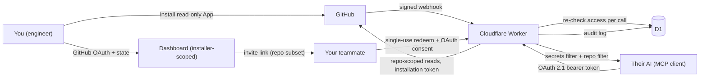

# Security Policy

Souperuser's entire purpose is safe, read-only access to source code — security reports are taken seriously and are very welcome.

## Reporting a vulnerability

Please report vulnerabilities **privately** via [GitHub's private vulnerability reporting](https://github.com/souperuserhq/souperuser/security/advisories/new) on this repository. Do not open public issues for security problems.

You can expect an initial response within a few days. Please include reproduction steps and the potential impact.

## Security model (what Souperuser guarantees)

- **Read-only by construction**: the GitHub App requests only `contents: read` and `metadata: read`. It cannot write, even if fully compromised.
- **GitHub enforces the outer boundary**: installation tokens can only read repos the installing engineer selected. Application bugs cannot widen that boundary.
- **Per-person repo lists**: every access token is bound to one invited person, whose repo list is a subset of one installation's repos, re-checked on every tool call. Search results are additionally dropped unless they come from the exact repo that was requested, so no search query can widen the scope either.
- **No code storage**: repo contents are fetched from GitHub at request time and never persisted. Only short-lived installation tokens are cached (KV, 55 minutes).
- **Sensitive-file filter**: paths matching key/credential patterns are never served — see [`apps/ladle/src/core/secrets-filter.ts`](apps/ladle/src/core/secrets-filter.ts).
- **Single-use invites**: invite links are 256-bit random, expire after 7 days, and are burned atomically on first use — a raced second redemption gets nothing.
- **Audit log**: every tool call is recorded and visible on the dashboard. Revocation is checked per request and applies immediately.
- **Abuse throttling**: per-user rate limits on the MCP endpoint and per-IP limits on invite redemption and sign-in.

## Architecture and trust boundaries

The layers, from the outside in:

1. **GitHub → Worker**: webhooks are HMAC-verified (constant-time compare). The repo list in D1 is only ever written from verified webhooks or a re-sync triggered by the authenticated installing engineer.
2. **You → dashboard**: GitHub OAuth with a `state` nonce against login CSRF; sessions are HttpOnly/Secure/SameSite=Lax cookies. The dashboard and every mutating route are scoped to the engineer who installed the app — not to everyone GitHub lists as having repo access.
3. **Your teammate → Worker**: the invite link mints a signed identity cookie; the MCP connection is then authorized through OAuth 2.1 ([workers-oauth-provider](https://github.com/cloudflare/workers-oauth-provider)). Every MCP call re-resolves their access from the database, so revocation takes effect on the next request.
4. **Worker → GitHub**: one installation token per installation, scoped by GitHub itself. Every tool call is checked against the person's repo list before the token is used; code-search results are filtered to the requested repo; scope-widening search qualifiers (`repo:`, `org:`, `user:`) are rejected.
5. **Worker → browser**: server-rendered pages carry a strict CSP (scripts blocked entirely), `X-Frame-Options: DENY`, `Referrer-Policy: no-referrer` (invite URLs never leak via Referer), and `Cache-Control: no-store`. The `/dash/whoami` probe only reflects credentialed CORS for the configured public origin's own domain — never for shared suffixes like `workers.dev`.

## Known limitations

- **The secrets filter is path-based.** A credential hardcoded inside an otherwise-allowed source file (say, an API key in `src/config.ts`) is served like any other code. Don't commit secrets — the filter is a net, not a guarantee.
- **An unused invite link is a bearer credential.** Anyone holding an unexpired, unredeemed link can redeem it. Links are single-use and expire after 7 days — send them over a channel you trust, and revoke access if a link went astray.
- **Rate limits are approximate.** They ride on Cloudflare KV (eventually consistent), which is fine for abuse throttling but is not a hard quota.

## Scope

The hosted instance and this codebase are in scope. Vulnerabilities in dependencies should also be reported upstream.
